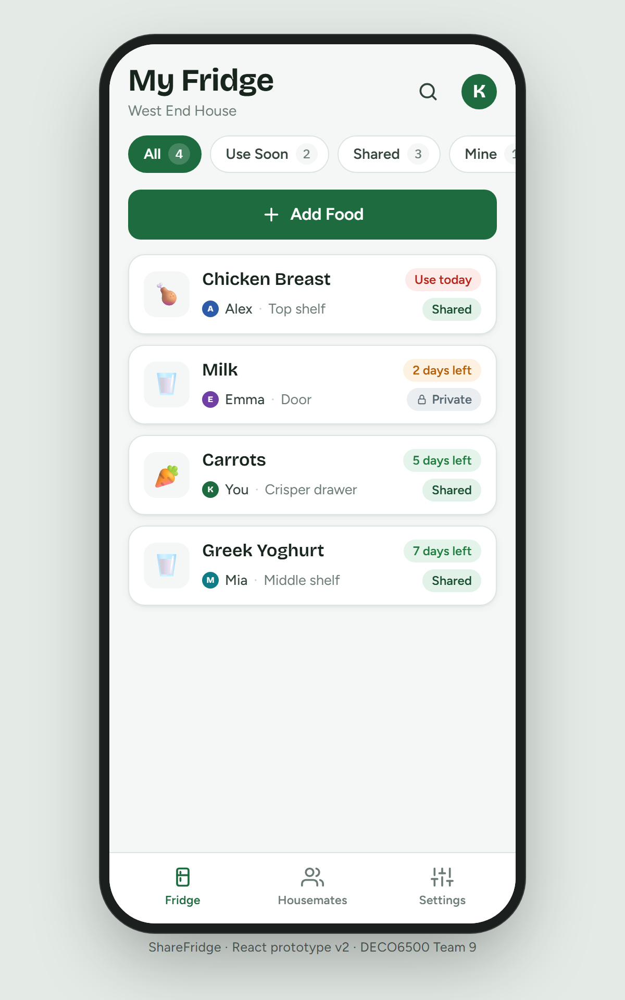

# ShareFridge

**Who owns what, what's shared, and what needs using soon — one glance at the shared fridge.**

ShareFridge is a mobile web app for people who share a fridge in student housing. It replaces the ad-hoc system most households run on — a name on the lid, a message in the group chat, "is this anyone's?" — with one list the whole house can see.

**Try it:** https://yueran-ml.github.io/6500/ — demo data only; nothing you enter leaves your browser.

<p align="center">
  
</p>

## The problem

Sharing a fridge produces the same small failures every week. Nobody is sure whether the milk on the door shelf is up for grabs. Something goes off at the back because the person who bought it forgot and nobody else felt entitled to use it. A duplicate gets bought because asking felt awkward. Each failure is minor; together they mean wasted food, wasted money and low-level friction between people who have to live together.

Household food waste is a recognised sustainability target (UN SDG 12.3: halve per-capita food waste by 2030). Shared student accommodation is a setting where a small coordination tool can plausibly help, because the fridge is genuinely shared and the people in the house are already coordinating — just badly.

## What ShareFridge does

- **One list for the household.** Every item shows its owner, whether it is Shared or Private, how urgently it should be used, and where in the fridge it is.
- **Ownership and permission are explicit.** Each housemate has a colour, like a sticker on a lid. Private means "mine, please ask"; Shared means "help yourself". Only the owner can edit or remove an item, and the app says so on the item itself.
- **Urgency you can read at a glance.** Expiry is shown as a food-safety traffic light: red for today or tomorrow, amber for two to three days, green for longer, and a distinct Expired state. The Use Soon filter pulls the red and amber items together.
- **Adding food takes under a minute.** Name, category, Shared or Private, expiry date, and an optional storage location. Required fields are checked inline, and a confirmation screen shows what was saved and takes you back to the item in the list.
- **Filters and search.** All / Use Soon / Shared / Mine with live counts, plus search by name, owner or category.

## Screens

| Screen | What it is for |
| --- | --- |
| My Fridge | The household list sorted by expiry, with filters and search |
| Food details | Owner, sharing status, expiry, urgency and storage, plus the permission notice; owners can edit or remove |
| Add / Edit Food | The entry form, with inline validation of required fields |
| Saved | Confirmation of what was added, with View in Fridge |
| Housemates | Who is in the house and how many items each has in the fridge |
| Settings | Household details, and a reset that restores the demo data |

## Design decisions

- **Explicit beats implicit.** Sharing status has no default; the form will not save until a choice is made. Making that decision visible is the one thing the app exists to do.
- **The list is the product.** Most use is a glance before cooking or before shopping, so the home screen carries everything needed to decide — owner, sharing, urgency, location — without opening anything.
- **Borrow the vernacular of the fridge.** Storage uses real fridge terms (crisper drawer, door, middle shelf). The detail screen carries a best-before stamp the way packaging does (`BB 30 SEP 2026`). Housemate colours echo the sticker-on-the-lid convention.
- **Keep the burden low.** The cost of the app to a household is data entry, so the form is short, tolerant of typos, and optional fields stay optional.

## Project context

ShareFridge was built by Team 9 for DECO6500 Social & Mobile Computing at The University of Queensland (Semester 2, 2026) as the artefact under evaluation in Assessment 2. The evaluation asks four questions across a layered model: can people read ownership and sharing correctly (interaction); does the prototype hold up in use (prototype); could checking food this way fit into a household routine (in-context use); and does it change how confident people feel about using shared food (human needs).

This repository is **prototype v2**. Version 1 was a Figma click-through. Verifying it before the study — a ten-point check, a heuristic review and an automated walkthrough — found nine defects, two of which would have made a task impossible to complete as written. Rather than script around them, the team rebuilt the prototype as a working web app, so that what participants experience is the design rather than the tooling.

Evaluation sessions use two silent standardised tasks — find an item and judge who may use it and what to use first; add an item from a card and confirm it appears — followed by post-task ratings, the System Usability Scale and a short interview.

## Demo data

The app ships with a fictional household, West End House: you are Kingsley, and your housemates are Alex, Emma and Mia. Four items are seeded and dated relative to the day the app was last reset, so Chicken Breast always reads "Use today". Everything is stored in your browser only. **Settings → Reset demo data** restores the seed and removes anything you added.

## Run it yourself

React 18 and Vite, no backend. Requires Node 18 or newer.

```bash
npm install
npm run dev
```

Pushing to `main` builds and publishes the site to GitHub Pages through `.github/workflows/deploy.yml`.

---

Built by Team 9, DECO6500, September 2026. Not connected to any real fridge.
